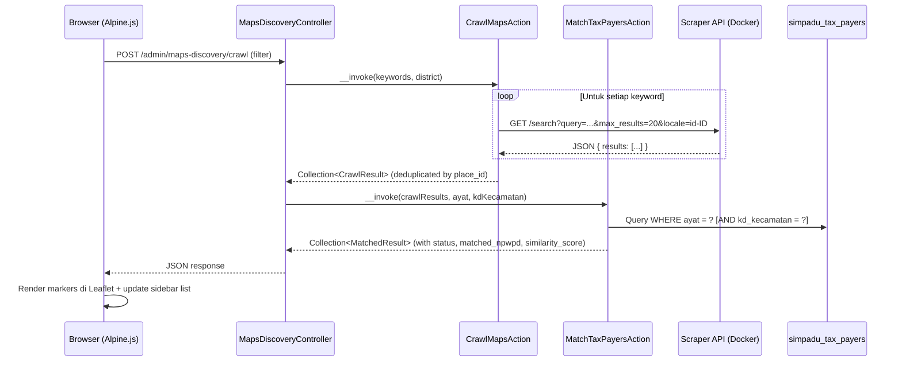
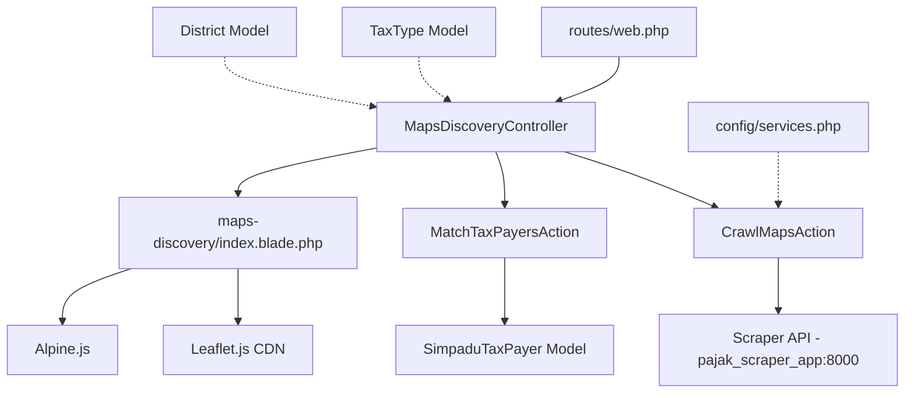

# Design Document: Maps WP Discovery

## Overview

Fitur Maps WP Discovery menambahkan halaman admin baru untuk menemukan potensi Wajib Pajak (WP) yang belum terdaftar di database `simpadu_tax_payers`. Sistem memanfaatkan Scraper API (`pajak_scraper_app`) untuk crawling lokasi bisnis dari Google Maps, lalu mencocokkan hasilnya dengan data WP terdaftar menggunakan fuzzy string matching.

Halaman ditampilkan dalam layout split-view: sidebar kiri berisi form filter dan daftar hasil, sisi kanan menampilkan peta interaktif Leaflet.js dengan marker berwarna berbeda (hijau = terdaftar, merah = potensi baru). Statistik ringkasan ditampilkan di atas peta.

### Keputusan Desain Utama

1. **AJAX-based crawling**: Proses crawling dilakukan via POST request AJAX (bukan full page reload) agar state filter tetap terjaga dan UX responsif.
2. **Action classes**: Logika bisnis (crawling + matching) dipisahkan ke action classes sesuai pola existing project.
3. **Config-driven scraper URL**: URL Scraper API disimpan di `config/services.php` agar mudah dikonfigurasi per environment.
4. **No database storage**: Hasil crawling tidak disimpan ke database — hanya ditampilkan real-time. Ini menjaga fitur tetap ringan dan menghindari data stale.
5. **PHP `similar_text`**: Menggunakan fungsi bawaan PHP untuk fuzzy matching karena sudah cukup akurat untuk perbandingan nama bisnis Indonesia dan tidak memerlukan dependency tambahan.

## Architecture



### Arsitektur Komponen



## Components and Interfaces

### 1. Config: `config/services.php`

Tambahkan konfigurasi scraper API ke file `config/services.php` yang sudah ada:

```php
'scraper' => [
    'url' => env('SCRAPER_API_URL', 'http://pajak_scraper_app:8000'),
    'timeout' => 30,
],
```

Environment variable di `.env`:
```
SCRAPER_API_URL=http://pajak_scraper_app:8000
```

### 2. Controller: `App\Http\Controllers\Admin\MapsDiscoveryController`

Path: `app/Http/Controllers/Admin/MapsDiscoveryController.php`

Mengikuti pola `ForecastingController` — controller ringan yang mendelegasikan logika ke action classes.

```php
class MapsDiscoveryController extends Controller
{
    // GET /admin/maps-discovery
    public function index(): View
    // POST /admin/maps-discovery/crawl  
    public function crawl(CrawlMapsDiscoveryRequest $request, CrawlMapsAction $crawlAction, MatchTaxPayersAction $matchAction): JsonResponse
}
```

**Method `index()`**:
- Query `TaxType` yang memiliki `simpadu_code` (untuk dropdown jenis pajak)
- Query `District` (untuk dropdown kecamatan)
- Return view `admin.maps-discovery.index`

**Method `crawl()`**:
- Menerima validated request dari `CrawlMapsDiscoveryRequest`
- Membangun daftar keywords dari `Keyword_Mapping` + keyword tambahan user
- Memanggil `CrawlMapsAction` untuk fetch data dari Scraper API
- Memanggil `MatchTaxPayersAction` untuk mencocokkan dengan database WP
- Return JSON response dengan hasil + statistik

### 3. Form Request: `App\Http\Requests\Admin\CrawlMapsDiscoveryRequest`

Path: `app/Http/Requests/Admin/CrawlMapsDiscoveryRequest.php`

```php
class CrawlMapsDiscoveryRequest extends FormRequest
{
    public function rules(): array
    {
        return [
            'tax_type_code' => ['nullable', 'string', 'max:10'],
            'district_id' => ['nullable', 'string', 'exists:districts,id'],
            'keyword' => ['nullable', 'string', 'max:200'],
        ];
    }

    // Custom validation: tax_type_code atau keyword harus diisi minimal salah satu
    public function withValidator(Validator $validator): void
    {
        $validator->after(function (Validator $v) {
            if (empty($this->tax_type_code) && empty(trim($this->keyword ?? ''))) {
                $v->errors()->add('tax_type_code', 'Pilih jenis pajak atau isi keyword pencarian.');
            }
        });
    }
}
```

### 4. Action: `App\Actions\MapsDiscovery\CrawlMapsAction`

Path: `app/Actions/MapsDiscovery/CrawlMapsAction.php`

Single-responsibility: mengirim request ke Scraper API dan mengembalikan hasil crawling yang sudah di-deduplikasi.

```php
class CrawlMapsAction
{
    /**
     * @param list<string> $keywords
     * @param string $area Nama wilayah pencarian (e.g. "Pasuruan" atau "Kecamatan Bangil Pasuruan")
     * @return Collection<int, array{title: string, subtitle: string, category: string, place_id: string, url: string, latitude: ?float, longitude: ?float}>
     * @throws \App\Exceptions\ScraperUnavailableException
     * @throws \App\Exceptions\ScraperErrorException
     */
    public function __invoke(array $keywords, string $area, int $maxResults = 20): Collection
}
```

Logika:
- Untuk setiap keyword, kirim `GET` ke `config('services.scraper.url') . '/search'` dengan params: `query` = `"{keyword} {area}"`, `max_results`, `locale=id-ID`
- Timeout: `config('services.scraper.timeout')` (30 detik)
- Handle `ConnectionException` → throw `ScraperUnavailableException` (HTTP 503)
- Handle non-200 response → throw `ScraperErrorException` (HTTP 500)
- Gabungkan semua results, deduplikasi berdasarkan `place_id`
- Return collection of crawl result arrays

### 5. Action: `App\Actions\MapsDiscovery\MatchTaxPayersAction`

Path: `app/Actions/MapsDiscovery/MatchTaxPayersAction.php`

Single-responsibility: mencocokkan hasil crawling dengan data WP terdaftar.

```php
class MatchTaxPayersAction
{
    private const SIMILARITY_THRESHOLD = 0.6;

    /**
     * @param Collection $crawlResults Hasil dari CrawlMapsAction
     * @param string|null $ayat Kode ayat pajak untuk filter WP
     * @param string|null $kdKecamatan Kode kecamatan untuk filter WP
     * @return Collection<int, array{
     *     title: string, subtitle: string, category: string, place_id: string,
     *     url: string, latitude: ?float, longitude: ?float,
     *     status: string, matched_npwpd: ?string, matched_name: ?string, similarity_score: float
     * }>
     */
    public function __invoke(Collection $crawlResults, ?string $ayat = null, ?string $kdKecamatan = null): Collection
}
```

Logika matching:
1. Query `SimpaduTaxPayer` dengan filter `ayat` dan `kd_kecamatan`
2. Untuk setiap crawl result, bandingkan:
   - `title` vs `nm_wp` dan `nm_op` → ambil skor tertinggi (nama)
   - `subtitle` vs `almt_op` → skor alamat
3. Gunakan `similar_text()` PHP yang dinormalisasi (0.0 - 1.0)
4. Jika skor nama >= 0.6 ATAU skor alamat >= 0.6 → status `"terdaftar"`
5. Jika tidak ada yang cocok → status `"potensi_baru"`
6. Return collection dengan tambahan field: `status`, `matched_npwpd`, `matched_name`, `similarity_score`

### 6. View: `resources/views/admin/maps-discovery/index.blade.php`

Layout split-view menggunakan `<x-layouts.admin>` (pola existing). Menggunakan Alpine.js untuk state management dan Leaflet.js dari CDN untuk peta.

**Struktur layout:**
```
┌─────────────────────────────────────────────────┐
│  <x-layouts.admin title="Maps WP Discovery">   │
├──────────────┬──────────────────────────────────┤
│  Sidebar     │  Main Content                    │
│  (w-1/3)     │  (w-2/3)                         │
│              │                                  │
│  ┌────────┐  │  ┌────────────────────────────┐  │
│  │ Filter │  │  │ Stats Cards (Terdaftar |   │  │
│  │ Form   │  │  │ Potensi Baru)              │  │
│  └────────┘  │  └────────────────────────────┘  │
│              │  ┌────────────────────────────┐  │
│  ┌────────┐  │  │                            │  │
│  │ Result │  │  │   Leaflet Map              │  │
│  │ List   │  │  │   (center: -7.6455,        │  │
│  │        │  │  │    112.9075, zoom: 12)     │  │
│  │        │  │  │                            │  │
│  └────────┘  │  └────────────────────────────┘  │
├──────────────┴──────────────────────────────────┤
│  @push('scripts') - Leaflet CDN + Alpine logic  │
└─────────────────────────────────────────────────┘
```

**Alpine.js component (`x-data`):**
```javascript
{
    loading: false,
    results: [],
    error: null,
    stats: { terdaftar: 0, potensi_baru: 0 },
    
    async crawl() { /* POST ke /admin/maps-discovery/crawl */ },
    panToMarker(index) { /* Pan map + open popup */ },
    renderMarkers() { /* Clear + add markers ke Leaflet map */ },
}
```

**Leaflet.js:**
- CDN: `https://unpkg.com/leaflet@1.9.4/dist/leaflet.js` + CSS
- Tile layer: OpenStreetMap
- Custom marker icons: hijau (terdaftar), merah (potensi baru) menggunakan `L.divIcon` dengan Tailwind classes
- Popup content: nama, alamat, kategori, status, link Google Maps, dan info NPWPD (jika terdaftar)

### 7. Keyword Mapping

Didefinisikan sebagai constant di `CrawlMapsAction` atau sebagai config terpisah. Mengingat mapping ini bersifat statis dan terkait langsung dengan logika crawling, lebih tepat sebagai class constant:

```php
public const KEYWORD_MAPPING = [
    '41101' => ['hotel'],
    '41102' => ['restoran', 'cafe', 'rumah makan'],
    '41103' => ['hiburan', 'karaoke', 'bioskop'],
    '41104' => ['parkir'],
    '41105' => ['penerangan jalan'],
    '41107' => ['reklame'],
    '41108' => ['air tanah'],
    '41111' => ['sarang burung walet'],
];
```

### 8. Routes

Ditambahkan di `routes/web.php` dalam group admin yang sudah ada:

```php
// Maps WP Discovery
Route::get('maps-discovery', [MapsDiscoveryController::class, 'index'])->name('maps-discovery.index');
Route::post('maps-discovery/crawl', [MapsDiscoveryController::class, 'crawl'])->name('maps-discovery.crawl');
```

Ditempatkan di dalam group `Route::middleware(['auth', 'role:admin|kepala_upt|pemimpin'])` yang sudah ada, sehingga otomatis mendapat middleware `auth`.

### 9. Exception Classes

**`App\Exceptions\ScraperUnavailableException`** — Dilempar ketika Scraper API tidak dapat dijangkau (connection refused). Controller menangkap dan mengembalikan HTTP 503.

**`App\Exceptions\ScraperErrorException`** — Dilempar ketika Scraper API mengembalikan HTTP error atau timeout. Controller menangkap dan mengembalikan HTTP 500.

## Data Models

### Existing Models (Tidak Dimodifikasi)

#### `SimpaduTaxPayer`
Tabel: `simpadu_tax_payers`
```
npwpd          string    — Nomor Pokok WP Daerah
nop            string    — Nomor Objek Pajak
ayat           string    — Kode jenis pajak (e.g. "41101")
year           int       — Tahun
month          int       — Bulan
nm_wp          string    — Nama Wajib Pajak
nm_op          string    — Nama Objek Pajak
almt_op        string    — Alamat Objek Pajak
kd_kecamatan   string    — Kode kecamatan
total_ketetapan decimal  — Total ketetapan
total_bayar    decimal   — Total pembayaran
total_tunggakan decimal  — Total tunggakan
status         string    — Status WP
```

#### `TaxType`
Tabel: `tax_types`
```
id             uuid      — Primary key
name           string    — Nama jenis pajak
code           string    — Kode internal
simpadu_code   string    — Kode ayat SIMPADU (e.g. "41101")
parent_id      uuid|null — Parent untuk sub-jenis
```

#### `District`
Tabel: `districts`
```
id             uuid      — Primary key
name           string    — Nama kecamatan
code           string    — Kode internal
simpadu_code   string    — Kode kecamatan SIMPADU
```

### Data Transfer Objects (Implicit)

Tidak perlu membuat DTO class formal — menggunakan associative arrays yang sudah di-type-hint via PHPDoc (sesuai pola existing project). Struktur data yang mengalir:

#### Crawl Result (dari CrawlMapsAction)
```php
[
    'title' => string,       // Nama tempat dari Google Maps
    'subtitle' => string,    // Alamat dari Google Maps
    'category' => string,    // Kategori bisnis
    'place_id' => string,    // Google Maps place ID (untuk deduplikasi)
    'url' => string,         // URL Google Maps
    'latitude' => ?float,    // Koordinat latitude
    'longitude' => ?float,   // Koordinat longitude
]
```

#### Matched Result (dari MatchTaxPayersAction)
```php
[
    // ... semua field dari Crawl Result, ditambah:
    'status' => 'terdaftar' | 'potensi_baru',
    'matched_npwpd' => ?string,    // NPWPD WP yang cocok
    'matched_name' => ?string,     // Nama WP yang cocok
    'similarity_score' => float,   // Skor kesamaan tertinggi (0.0 - 1.0)
]
```

#### JSON Response (dari Controller ke Frontend)
```json
{
    "results": [
        {
            "title": "Hotel Surya",
            "subtitle": "Jl. Raya Bangil No. 10, Pasuruan",
            "category": "Hotel",
            "place_id": "ChIJ...",
            "url": "https://maps.google.com/...",
            "latitude": -7.6012,
            "longitude": 112.7834,
            "status": "terdaftar",
            "matched_npwpd": "P-001234",
            "matched_name": "HOTEL SURYA JAYA",
            "similarity_score": 0.85
        }
    ],
    "stats": {
        "total": 15,
        "terdaftar": 8,
        "potensi_baru": 7
    }
}
```

### Batas Koordinat Jawa Timur (untuk validasi marker)

Digunakan di frontend untuk memfilter marker yang ditampilkan di peta:
```javascript
const JATIM_BOUNDS = {
    latMin: -8.5, latMax: -7.0,
    lngMin: 111.0, lngMax: 114.5
};
```

Crawl result dengan koordinat di luar batas ini tetap diproses untuk matching, tetapi tidak ditampilkan sebagai marker di peta (sesuai Requirement 7.3).


## Correctness Properties

*A property is a characteristic or behavior that should hold true across all valid executions of a system — essentially, a formal statement about what the system should do. Properties serve as the bridge between human-readable specifications and machine-verifiable correctness guarantees.*

### Property 1: Keyword list construction dari mapping + tambahan

*For any* kode ayat yang ada di `KEYWORD_MAPPING` dan *for any* string keyword tambahan (termasuk kosong), daftar keyword yang dihasilkan harus mengandung semua keyword default dari mapping untuk ayat tersebut, ditambah keyword tambahan jika tidak kosong. Panjang daftar keyword = jumlah keyword mapping + (1 jika keyword tambahan non-empty, 0 jika kosong).

**Validates: Requirements 1.2, 1.3**

### Property 2: Query pencarian mengandung keyword dan area

*For any* keyword dan *for any* nama area (nama kecamatan atau "Pasuruan"), query string yang dikirim ke Scraper API harus mengandung keyword tersebut dan nama area. Jika kecamatan dipilih, area harus mengandung nama kecamatan; jika tidak, area harus "Pasuruan".

**Validates: Requirements 1.5, 2.1**

### Property 3: Parsing response Scraper API

*For any* valid JSON response dari Scraper API yang mengandung array `results` dengan item yang memiliki field `title`, `subtitle`, `category`, `place_id`, `url`, `latitude`, `longitude`, parsing harus mengekstrak semua field tersebut tanpa kehilangan data. Jumlah item hasil parsing = jumlah item di `results` array.

**Validates: Requirements 2.2**

### Property 4: Deduplikasi berdasarkan place_id

*For any* kumpulan crawl results (dari satu atau lebih request), setelah deduplikasi, semua `place_id` dalam hasil harus unik. Jumlah hasil deduplikasi <= jumlah total input. Jika tidak ada duplikat, jumlah tetap sama.

**Validates: Requirements 2.3**

### Property 5: Similarity score invariant

*For any* dua string, similarity score yang dihitung oleh fungsi matching harus berada dalam range [0.0, 1.0]. *For any* string yang identik (setelah normalisasi), similarity score harus = 1.0. *For any* dua string yang sama sekali berbeda (tidak ada karakter yang sama), similarity score harus = 0.0.

**Validates: Requirements 3.2, 3.3**

### Property 6: Klasifikasi WP terdaftar vs potensi baru

*For any* crawl result dan *for any* set data WP terdaftar: jika ada minimal satu WP dengan similarity score nama >= 0.6 ATAU similarity score alamat >= 0.6, maka status harus `"terdaftar"` dan `matched_npwpd` harus non-null. Jika tidak ada WP yang memenuhi threshold, status harus `"potensi_baru"` dan `matched_npwpd` harus null.

**Validates: Requirements 3.4, 3.5**

### Property 7: Output matching mengandung semua field yang diperlukan

*For any* crawl result yang diproses oleh MatchTaxPayersAction, output harus mengandung semua field asli dari crawl result (`title`, `subtitle`, `category`, `place_id`, `url`, `latitude`, `longitude`) ditambah field matching (`status`, `matched_npwpd`, `matched_name`, `similarity_score`). Tidak ada field yang hilang.

**Validates: Requirements 3.6**

### Property 8: Partisi statistik terdaftar + potensi baru = total

*For any* set hasil matching, jumlah item dengan status `"terdaftar"` + jumlah item dengan status `"potensi_baru"` harus sama dengan total jumlah item. Tidak ada status lain selain kedua nilai tersebut.

**Validates: Requirements 6.1**

### Property 9: Koordinat invalid tidak mempengaruhi proses matching

*For any* crawl result dengan `latitude` null, `longitude` null, atau koordinat di luar batas Jawa Timur (lat -8.5 s/d -7.0, lng 111.0 s/d 114.5), proses matching tetap berjalan dan menghasilkan status yang benar. Hasil matching untuk item tersebut harus identik dengan jika koordinat valid — hanya tampilan marker di peta yang berbeda.

**Validates: Requirements 7.3**

## Error Handling

### Scraper API Errors

| Kondisi | Exception | HTTP Status | Pesan User |
|---------|-----------|-------------|------------|
| Connection refused | `ScraperUnavailableException` | 503 | "Layanan scraper tidak tersedia. Hubungi administrator." |
| HTTP error (4xx/5xx) | `ScraperErrorException` | 500 | "Gagal mengambil data dari Google Maps. Pastikan layanan scraper aktif." |
| Timeout (>30s) | `ScraperErrorException` | 500 | "Gagal mengambil data dari Google Maps. Pastikan layanan scraper aktif." |
| Results kosong | — (bukan error) | 200 | "Tidak ditemukan lokasi bisnis untuk pencarian ini. Coba ubah keyword atau wilayah." |

### Validation Errors

| Kondisi | HTTP Status | Pesan |
|---------|-------------|-------|
| Jenis pajak dan keyword keduanya kosong | 422 | "Pilih jenis pajak atau isi keyword pencarian." |

### Frontend Error Handling

- Error dari AJAX ditampilkan sebagai notifikasi di area hasil (bukan alert/modal)
- State filter dipertahankan saat error terjadi (user tidak perlu mengisi ulang)
- Loading state di-reset saat error terjadi
- Network error (fetch gagal) ditangkap dan ditampilkan pesan generic

### Logging

- Semua error dari Scraper API di-log via `Log::warning()` atau `Log::error()` dengan context (keyword, status code, response body)
- Mengikuti pola existing di `GetTaxForecastAction`

## Testing Strategy

### Property-Based Testing

Library: **Pest** dengan custom data providers yang menghasilkan input random. Karena Pest v3 tidak memiliki built-in property-based testing library, kita menggunakan pendekatan data provider dengan randomized inputs (minimal 100 iterasi per test).

Setiap property test harus:
- Menjalankan minimal 100 iterasi dengan input random
- Memiliki tag comment yang mereferensikan property di design document
- Format tag: `Feature: maps-wp-discovery, Property {number}: {property_text}`

**Property tests yang harus diimplementasikan:**

1. **Property 1 test**: Generate random ayat codes dari KEYWORD_MAPPING + random additional keywords → verify keyword list construction
2. **Property 4 test**: Generate random crawl results dengan duplicate place_ids → verify deduplikasi menghasilkan unique place_ids
3. **Property 5 test**: Generate random string pairs → verify similarity score dalam range [0.0, 1.0], identical strings = 1.0
4. **Property 6 test**: Generate random crawl results + random WP data → verify klasifikasi sesuai threshold
5. **Property 7 test**: Generate random crawl results → verify output mengandung semua required fields
6. **Property 8 test**: Generate random matched results → verify terdaftar + potensi_baru = total

### Unit Tests (Specific Examples & Edge Cases)

**CrawlMapsAction tests:**
- Keyword mapping menghasilkan keyword yang benar untuk setiap ayat (example)
- Default area "Pasuruan" ketika kecamatan tidak dipilih (edge case dari 1.4)
- Validasi gagal ketika jenis pajak dan keyword keduanya kosong (edge case dari 1.6)
- Scraper API connection refused → ScraperUnavailableException (example dari 2.5)
- Scraper API HTTP error → ScraperErrorException (example dari 2.4)
- Timeout configuration = 30 detik (example dari 2.6)

**MatchTaxPayersAction tests:**
- Matching dengan data WP yang persis sama → status terdaftar (example)
- Matching tanpa data WP → semua potensi_baru (example)
- Crawl result dengan koordinat null tetap diproses (edge case dari 7.3)
- Results kosong dari scraper → empty collection (edge case dari 7.1)

**Controller tests (Feature tests):**
- GET /admin/maps-discovery menampilkan halaman dengan filter (example dari 1.1)
- POST /admin/maps-discovery/crawl dengan filter valid → JSON response (example)
- Unauthenticated user di-redirect ke login (example dari 8.2, 8.3)
- Route terdaftar dengan nama yang benar (example dari 8.1)

### Test File Structure

```
tests/
├── Feature/
│   └── Admin/
│       └── MapsDiscoveryControllerTest.php
└── Unit/
    └── Actions/
        └── MapsDiscovery/
            ├── CrawlMapsActionTest.php
            └── MatchTaxPayersActionTest.php
```
