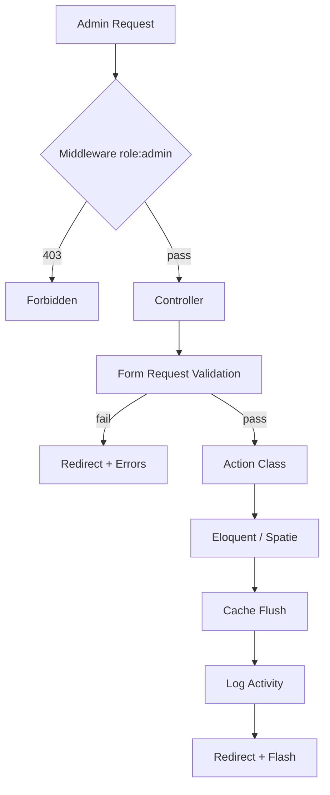

# Design Document: RBAC Management

## Overview

Fitur RBAC Management membangun lapisan manajemen akses dinamis di atas Spatie Permission yang sudah ada. Saat ini sidebar dikontrol dengan `isAdmin()` / `isKepalaUpt()` hardcoded dan tidak ada UI untuk mengelola role/permission. Fitur ini menambahkan:

1. CRUD Role dengan proteksi System_Role
2. CRUD Permission dengan pengelompokan per Permission_Group
3. Assignment Permission ke Role via checklist + sync atomik
4. Manajemen User RBAC (buat, edit, hapus, assign role)
5. Monitoring matriks akses per Role
6. Sidebar berbasis permission (mengganti kondisi hardcoded)
7. Proteksi route + audit log

Seluruh fitur hanya dapat diakses oleh user dengan role `admin`. Sistem tetap menggunakan guard `web` dan memanfaatkan cache Spatie Permission yang sudah dikonfigurasi.

---

## Architecture

### Pola Arsitektur

Mengikuti pola yang sudah ada: **Controller → Action → View (Blade)**

```
HTTP Request
    └── RbacController (thin, hanya orchestrate)
            └── Action class (business logic)
                    └── Eloquent Model / Spatie Permission
                            └── Blade View (presentasi)
```

### Komponen Baru

```
app/
├── Http/
│   ├── Controllers/Admin/
│   │   ├── RoleController.php
│   │   ├── PermissionController.php
│   │   ├── RbacUserController.php
│   │   └── AccessMonitoringController.php
│   └── Requests/Admin/
│       ├── StoreRoleRequest.php
│       ├── UpdateRoleRequest.php
│       ├── StorePermissionRequest.php
│       ├── UpdatePermissionRequest.php
│       ├── SyncRolePermissionsRequest.php
│       ├── StoreRbacUserRequest.php
│       └── UpdateRbacUserRequest.php
├── Actions/Admin/
│   ├── CreateRoleAction.php
│   ├── UpdateRoleAction.php
│   ├── DeleteRoleAction.php
│   ├── CreatePermissionAction.php
│   ├── DeletePermissionAction.php
│   ├── SyncRolePermissionsAction.php
│   ├── CreateRbacUserAction.php
│   ├── UpdateRbacUserAction.php
│   └── DeleteRbacUserAction.php
└── Support/
    └── SidebarPermissionMap.php

database/seeders/
└── PermissionSeeder.php

resources/views/admin/
├── roles/
│   ├── index.blade.php
│   ├── create.blade.php
│   ├── edit.blade.php
│   └── show.blade.php
├── permissions/
│   ├── index.blade.php
│   ├── create.blade.php
│   └── edit.blade.php
├── rbac-users/
│   ├── index.blade.php
│   ├── create.blade.php
│   └── edit.blade.php
└── access-monitoring/
    ├── index.blade.php
    └── show.blade.php
```

### Diagram Alur Utama



---

## Components and Interfaces

### Controllers

#### `RoleController`
| Method | Route | Deskripsi |
|--------|-------|-----------|
| `index()` | GET `/admin/roles` | Daftar role + jumlah user & permission |
| `create()` | GET `/admin/roles/create` | Form buat role baru |
| `store()` | POST `/admin/roles` | Simpan role baru |
| `show()` | GET `/admin/roles/{role}` | Detail role: checklist permission + daftar user |
| `update()` | PUT `/admin/roles/{role}` | Update nama role |
| `destroy()` | DELETE `/admin/roles/{role}` | Hapus role (dengan validasi) |
| `syncPermissions()` | PUT `/admin/roles/{role}/permissions` | Sync permission ke role |

#### `PermissionController`
| Method | Route | Deskripsi |
|--------|-------|-----------|
| `index()` | GET `/admin/permissions` | Daftar permission grouped by group |
| `create()` | GET `/admin/permissions/create` | Form buat permission |
| `store()` | POST `/admin/permissions` | Simpan permission baru |
| `destroy()` | DELETE `/admin/permissions/{permission}` | Hapus permission |

#### `RbacUserController`
| Method | Route | Deskripsi |
|--------|-------|-----------|
| `index()` | GET `/admin/rbac-users` | Daftar user + role + search |
| `create()` | GET `/admin/rbac-users/create` | Form buat user |
| `store()` | POST `/admin/rbac-users` | Simpan user baru |
| `edit()` | GET `/admin/rbac-users/{user}/edit` | Form edit user |
| `update()` | PUT `/admin/rbac-users/{user}` | Update user + role |
| `destroy()` | DELETE `/admin/rbac-users/{user}` | Hapus user |

#### `AccessMonitoringController`
| Method | Route | Deskripsi |
|--------|-------|-----------|
| `index()` | GET `/admin/access-monitoring` | Matriks akses semua role |
| `show()` | GET `/admin/access-monitoring/{role}` | Detail permission satu role |

### Action Classes

Setiap action adalah invokable class dengan satu tanggung jawab:

```php
// Contoh: SyncRolePermissionsAction
class SyncRolePermissionsAction
{
    public function __invoke(Role $role, array $permissionIds): void
    {
        DB::transaction(function () use ($role, $permissionIds): void {
            $role->syncPermissions($permissionIds);
            app()->make(\Spatie\Permission\PermissionRegistrar::class)->forgetCachedPermissions();
            Log::info('RBAC: permissions synced', [
                'admin' => auth()->id(),
                'role' => $role->name,
                'permissions' => $permissionIds,
                'at' => now()->toIso8601String(),
            ]);
        });
    }
}
```

### `SidebarPermissionMap`

Konfigurasi terpusat mapping permission → item sidebar. Menggantikan kondisi `isAdmin()` / `isKepalaUpt()` hardcoded.

```php
class SidebarPermissionMap
{
    /**
     * @return array<string, array{label: string, items: list<array{permission: string|null, route: string, label: string, icon: string}>}>
     */
    public static function groups(): array
    {
        return [
            'master-data' => [
                'label' => 'Master Data',
                'items' => [
                    ['permission' => 'view tax-types',   'route' => 'admin.tax-types.index',  'label' => 'Jenis Pajak',  'icon' => '...'],
                    ['permission' => 'view districts',   'route' => 'admin.districts.index',  'label' => 'Kecamatan',   'icon' => '...'],
                    ['permission' => 'view employees',   'route' => 'admin.employees.index',  'label' => 'Pegawai',     'icon' => '...'],
                    ['permission' => 'view upts',        'route' => 'admin.upts.index',       'label' => 'UPT',         'icon' => '...'],
                ],
            ],
            'monitoring' => [
                'label' => 'Pengelolaan',
                'items' => [
                    ['permission' => 'view forecasting',            'route' => 'admin.forecasting.index',           'label' => 'Prediksi Penerimaan',   'icon' => '...'],
                    ['permission' => 'view tax-targets',            'route' => 'admin.tax-targets.report',          'label' => 'Target APBD',           'icon' => '...'],
                    ['permission' => 'view realization-monitoring', 'route' => 'admin.realization-monitoring.index','label' => 'Monitoring Realisasi',  'icon' => '...'],
                    ['permission' => 'import data',                 'route' => 'admin.import.index',                'label' => 'Import Data',           'icon' => '...'],
                ],
            ],
            'rbac' => [
                'label' => 'Manajemen Akses',
                'items' => [
                    ['permission' => 'view roles',       'route' => 'admin.roles.index',            'label' => 'Role',              'icon' => '...'],
                    ['permission' => 'view permissions', 'route' => 'admin.permissions.index',       'label' => 'Permission',        'icon' => '...'],
                    ['permission' => 'view rbac-users',  'route' => 'admin.rbac-users.index',        'label' => 'User',              'icon' => '...'],
                    ['permission' => 'view access-monitoring', 'route' => 'admin.access-monitoring.index', 'label' => 'Monitoring Akses', 'icon' => '...'],
                ],
            ],
        ];
    }
}
```

Item dengan `permission => null` (Dashboard, Profil) selalu ditampilkan untuk semua user yang sudah login.

---

## Data Models

### Tabel yang Sudah Ada (Tidak Berubah)

| Tabel | Keterangan |
|-------|-----------|
| `roles` | UUID PK, `name`, `guard_name` — dikelola Spatie |
| `permissions` | UUID PK, `name`, `guard_name` — dikelola Spatie |
| `model_has_roles` | Pivot user ↔ role |
| `model_has_permissions` | Pivot user ↔ permission langsung |
| `role_has_permissions` | Pivot role ↔ permission |
| `users` | UUID PK, `name`, `email`, `password`, `role_id` (FK ke roles) |
| `upt_users` | Pivot user ↔ UPT |

### Migration Baru: Kolom `group` pada `permissions`

Spatie Permission tidak menyediakan kolom `group` secara default. Perlu migration untuk menambahkan kolom ini:

```php
// Migration: add_group_to_permissions_table
Schema::table('permissions', function (Blueprint $table): void {
    $table->string('group')->default('general')->after('guard_name')->index();
});
```

Kolom `group` diisi saat seeder dan saat admin membuat permission baru. Nilai group mengikuti konvensi kebab-case: `master-data`, `monitoring`, `field-officer`, `rbac`.

### Model `Permission` (diperbarui)

```php
class Permission extends SpatiePermission
{
    use HasUuids;

    protected $keyType = 'string';
    public $incrementing = false;

    /** @var list<string> */
    protected $fillable = ['name', 'guard_name', 'group'];

    /** Scope untuk filter per group */
    public function scopeByGroup(Builder $query, string $group): Builder
    {
        return $query->where('group', $group);
    }
}
```

### Konstanta System Roles

Didefinisikan sebagai konstanta di model `Role` untuk menghindari magic string:

```php
class Role extends SpatieRole
{
    use HasUuids;

    public const SYSTEM_ROLES = ['admin', 'kepala_upt', 'pegawai', 'pemimpin'];

    public function isSystemRole(): bool
    {
        return in_array($this->name, self::SYSTEM_ROLES, true);
    }
}
```

### Permission Naming Convention

Format: `{action} {resource}` — semua lowercase, spasi sebagai separator.

| Group | Permission |
|-------|-----------|
| `master-data` | `view tax-types`, `manage tax-types` |
| `master-data` | `view districts`, `manage districts` |
| `master-data` | `view employees`, `manage employees` |
| `master-data` | `view upts`, `manage upts` |
| `monitoring` | `view forecasting` |
| `monitoring` | `view tax-targets`, `manage tax-targets` |
| `monitoring` | `view realization-monitoring`, `export realization-monitoring` |
| `monitoring` | `import data` |
| `field-officer` | `view field-officer` |
| `rbac` | `view roles`, `manage roles` |
| `rbac` | `view permissions`, `manage permissions` |
| `rbac` | `view rbac-users`, `manage rbac-users` |
| `rbac` | `view access-monitoring` |

### Default Permission Assignment per System Role

| Permission | admin | kepala_upt | pegawai | pemimpin |
|-----------|:-----:|:----------:|:-------:|:--------:|
| `view tax-types` | ✓ | ✓ | | |
| `manage tax-types` | ✓ | ✓ | | |
| `view districts` | ✓ | ✓ | | |
| `manage districts` | ✓ | ✓ | | |
| `view employees` | ✓ | ✓ | | |
| `manage employees` | ✓ | ✓ | | |
| `view upts` | ✓ | ✓ | | |
| `manage upts` | ✓ | ✓ | | |
| `view forecasting` | ✓ | ✓ | | ✓ |
| `view tax-targets` | ✓ | | | ✓ |
| `manage tax-targets` | ✓ | | | |
| `view realization-monitoring` | ✓ | ✓ | | ✓ |
| `export realization-monitoring` | ✓ | ✓ | | ✓ |
| `import data` | ✓ | | | |
| `view field-officer` | | | ✓ | |
| `view roles` | ✓ | | | |
| `manage roles` | ✓ | | | |
| `view permissions` | ✓ | | | |
| `manage permissions` | ✓ | | | |
| `view rbac-users` | ✓ | | | |
| `manage rbac-users` | ✓ | | | |
| `view access-monitoring` | ✓ | | | |

### Route Definitions

```php
Route::middleware(['auth', 'role:admin'])
    ->prefix('admin')
    ->name('admin.')
    ->group(function (): void {
        // Role Management
        Route::resource('roles', RoleController::class);
        Route::put('roles/{role}/permissions', [RoleController::class, 'syncPermissions'])
            ->name('roles.permissions.sync');

        // Permission Management
        Route::resource('permissions', PermissionController::class)
            ->except(['show', 'edit', 'update']);

        // User RBAC Management
        Route::resource('rbac-users', RbacUserController::class)
            ->except(['show']);

        // Access Monitoring
        Route::get('access-monitoring', [AccessMonitoringController::class, 'index'])
            ->name('access-monitoring.index');
        Route::get('access-monitoring/{role}', [AccessMonitoringController::class, 'show'])
            ->name('access-monitoring.show');
    });
```

---


## Correctness Properties

*A property is a characteristic or behavior that should hold true across all valid executions of a system — essentially, a formal statement about what the system should do. Properties serve as the bridge between human-readable specifications and machine-verifiable correctness guarantees.*

### Property 1: Role count accuracy

*For any* set of roles in the system, the count of users and permissions displayed for each role must equal the actual count of users and permissions associated with that role in the database.

**Validates: Requirements 1.1**

---

### Property 2: Role creation round-trip

*For any* valid role name (non-empty string, not already existing), after calling the create action, the role must exist in the database with the correct name and guard `web`.

**Validates: Requirements 1.2**

---

### Property 3: Role rename preserves non-system roles

*For any* role that is not a System_Role, after updating its name to a new valid name, the role must exist with the new name and the old name must no longer exist.

**Validates: Requirements 1.4**

---

### Property 4: Role deletion invariants

*For any* role: (a) if it is a System_Role, the delete action must be rejected and the role must still exist; (b) if it has one or more active users, the delete action must be rejected and the role must still exist; (c) if it is not a System_Role and has no active users, the delete action must succeed and the role must no longer exist in the database.

**Validates: Requirements 1.5, 1.6, 1.7**

---

### Property 5: Permission grouping consistency

*For any* permission group name, all permissions returned when filtering by that group must have their `group` field equal to that group name — no permission from another group should appear.

**Validates: Requirements 2.1**

---

### Property 6: Permission creation round-trip

*For any* valid permission name and group (non-empty, name not already existing), after calling the create action, the permission must exist in the database with the correct name, group, and guard `web`.

**Validates: Requirements 2.2**

---

### Property 7: Permission deletion cascades to roles

*For any* permission that is assigned to one or more roles, after deleting that permission, none of those roles should still have that permission in their permission list.

**Validates: Requirements 2.5**

---

### Property 8: Permission seeder completeness

When the `PermissionSeeder` is run, all permissions defined in the seeder (covering groups `master-data`, `monitoring`, `field-officer`, `rbac`) must exist in the database.

**Validates: Requirements 2.4**

---

### Property 9: Role permission sync is exact

*For any* role and any subset of existing permissions, after calling the sync action with that subset, the role must have exactly those permissions — permissions previously held but not in the subset must be removed, and all permissions in the subset must be present.

**Validates: Requirements 3.2**

---

### Property 10: Role detail shows correct users

*For any* role, the list of users displayed on the role detail page must contain exactly the users who have that role assigned via Spatie's `model_has_roles` — no more, no less.

**Validates: Requirements 3.1, 3.5**

---

### Property 11: User search filters correctly

*For any* search query string, all users returned by the search must have either their `name` or `email` containing the query string (case-insensitive). Users whose name and email do not contain the query must not appear in results.

**Validates: Requirements 4.1**

---

### Property 12: User creation round-trip

*For any* valid user data (unique email, non-empty name, password, at least one role), after calling the create action, the user must exist in the database with the correct data and the specified role must be assigned via Spatie.

**Validates: Requirements 4.2**

---

### Property 13: kepala_upt requires UPT

*For any* attempt to create or update a user with role `kepala_upt` where no UPT is provided, the action must be rejected with a validation error — the user must not be created or updated.

**Validates: Requirements 4.5**

---

### Property 14: Role sync replaces previous roles

*For any* user with an existing role assignment, after syncing to a new set of roles, the user must have exactly the new roles — the previous roles must no longer be assigned.

**Validates: Requirements 4.6**

---

### Property 15: Minimum one admin invariant

*For any* system state where exactly one user has the `admin` role, attempting to delete that user must be rejected — the user must still exist and the admin role must still be assigned.

**Validates: Requirements 4.7, 4.8**

---

### Property 16: Access monitoring count accuracy

*For any* role, the permission count displayed in the monitoring view must equal the actual number of permissions assigned to that role, and the permissions must be correctly grouped by their `group` field.

**Validates: Requirements 5.2, 5.3**

---

### Property 17: Sidebar shows only permitted items

*For any* authenticated user, each sidebar menu item that requires a permission must only be visible if the user has that permission. Menu items with no permission requirement (Dashboard, Profil) must always be visible.

**Validates: Requirements 6.1, 6.2, 6.3**

---

### Property 18: RBAC routes require admin role

*For any* HTTP request to an RBAC management route (roles, permissions, rbac-users, access-monitoring) made by a user without the `admin` role, the response must be HTTP 403 Forbidden.

**Validates: Requirements 7.1, 7.2**

---

### Property 19: Invalid input is rejected by Form Request

*For any* RBAC form submission containing invalid data (empty required fields, duplicate names, invalid UUIDs), the Form Request validation must reject the request and return validation errors — no data must be persisted.

**Validates: Requirements 7.3**

---

### Property 20: Audit log records assignment changes

*For any* operation that changes role or permission assignments (sync permissions to role, sync role to user), the Laravel application log must contain an entry with the admin's user ID, the entity changed, and a timestamp.

**Validates: Requirements 7.5**

---

## Error Handling

### Validasi Input

Semua input divalidasi via Form Request sebelum sampai ke Action. Pesan error dalam Bahasa Indonesia mengikuti pola yang sudah ada di `StoreEmployeeRequest`.

| Kondisi Error | Respons |
|--------------|---------|
| Nama role/permission duplikat | Redirect back + `$errors` bag |
| Hapus System_Role | Redirect back + `session('error')` |
| Hapus role dengan user aktif | Redirect back + `session('error')` dengan jumlah user |
| Hapus satu-satunya admin | Redirect back + `session('error')` |
| kepala_upt tanpa UPT | Redirect back + `$errors` bag |
| Email user duplikat | Redirect back + `$errors` bag |

### Proteksi Route

- Middleware `role:admin` pada semua route RBAC → Spatie melempar `AuthorizationException` → Laravel mengembalikan 403
- Model binding otomatis via Route Model Binding; jika UUID tidak ditemukan → 404

### Transaksi Database

Operasi sync permission dan delete user dibungkus `DB::transaction()` untuk memastikan atomisitas. Jika terjadi exception di tengah transaksi, semua perubahan di-rollback.

### Cache Spatie Permission

Setiap Action yang mengubah assignment permission atau role memanggil:
```php
app()->make(\Spatie\Permission\PermissionRegistrar::class)->forgetCachedPermissions();
```
Ini dipanggil di dalam transaksi, setelah commit berhasil.

---

## Testing Strategy

### Pendekatan Dual Testing

Fitur ini menggunakan dua lapisan pengujian yang saling melengkapi:

1. **Unit/Feature Tests** — menguji contoh spesifik, edge case, dan kondisi error
2. **Property-Based Tests** — menguji properti universal di berbagai input yang di-generate

### Library Property-Based Testing

Gunakan **[Eris](https://github.com/giorgiosironi/eris)** untuk PHP property-based testing, atau alternatifnya implementasi manual dengan Pest datasets yang di-generate secara acak. Karena ekosistem PHP PBT masih terbatas, pendekatan yang direkomendasikan adalah **Pest Datasets** dengan data yang di-generate menggunakan Faker untuk mensimulasikan property testing.

Konfigurasi minimum: setiap property test dijalankan dengan minimal **100 variasi input** menggunakan `it()->with(fn() => generateCases(100))`.

### Unit / Feature Tests (Pest)

Fokus pada:
- Contoh spesifik yang mendemonstrasikan perilaku benar
- Edge case (System_Role, satu-satunya admin, kepala_upt tanpa UPT)
- Kondisi error dan validasi Form Request
- Integrasi antar komponen (Controller → Action → Model)

```
tests/Feature/Admin/
├── RoleManagementTest.php
├── PermissionManagementTest.php
├── RolePermissionSyncTest.php
├── RbacUserManagementTest.php
├── AccessMonitoringTest.php
└── SidebarPermissionTest.php
```

### Property-Based Tests

Setiap Correctness Property diimplementasikan sebagai satu test dengan banyak variasi input:

```php
// Contoh: Property 4 — Role deletion invariants
// Feature: rbac-management, Property 4: Role deletion invariants
it('rejects deletion of system roles', function (string $roleName) {
    $role = Role::where('name', $roleName)->first();
    $action = new DeleteRoleAction();

    expect(fn () => $action($role))->toThrow(RoleCannotBeDeletedException::class);
    expect(Role::where('name', $roleName)->exists())->toBeTrue();
})->with(array_map(fn ($name) => [$name], Role::SYSTEM_ROLES));
```

Tag format untuk setiap property test:
```
// Feature: rbac-management, Property {N}: {property_text}
```

### Konfigurasi Test

```php
// tests/Feature/Admin/RoleManagementTest.php
uses(RefreshDatabase::class);

beforeEach(function (): void {
    $this->admin = User::factory()->create();
    $this->admin->assignRole('admin');
    $this->actingAs($this->admin);
});
```

### Cakupan Test per Requirement

| Requirement | Tipe Test | Property |
|------------|-----------|---------|
| 1.1 Role list count | Feature | Property 1 |
| 1.2 Create role | Feature | Property 2 |
| 1.3 Duplicate name | Feature (edge case) | — |
| 1.4 Rename role | Feature | Property 3 |
| 1.5–1.7 Delete role | Feature | Property 4 |
| 2.1 Permission grouping | Feature | Property 5 |
| 2.2 Create permission | Feature | Property 6 |
| 2.4 Seeder | Feature (example) | Property 8 |
| 2.5 Delete cascades | Feature | Property 7 |
| 3.2 Sync permissions | Feature | Property 9 |
| 3.1, 3.5 Role detail | Feature | Property 10 |
| 4.1 User search | Feature | Property 11 |
| 4.2 Create user | Feature | Property 12 |
| 4.5 kepala_upt + UPT | Feature (edge case) | Property 13 |
| 4.6 Sync role | Feature | Property 14 |
| 4.7–4.8 Delete user | Feature | Property 15 |
| 5.2–5.3 Monitoring | Feature | Property 16 |
| 6.1–6.3 Sidebar | Feature | Property 17 |
| 7.1–7.2 Route protection | Feature | Property 18 |
| 7.3 Form validation | Feature | Property 19 |
| 7.5 Audit log | Feature | Property 20 |
